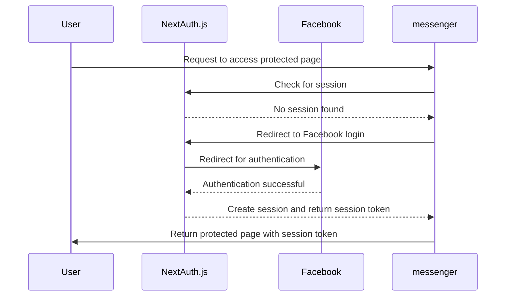
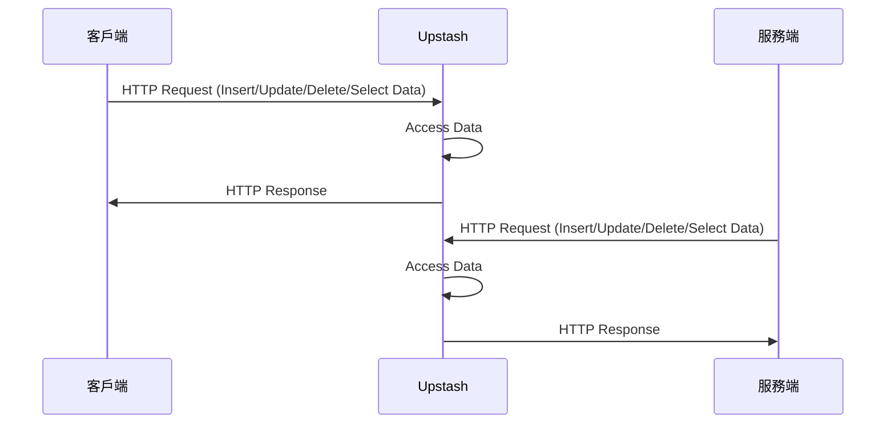
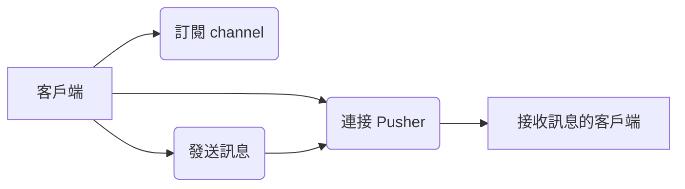

# Real time messenger

 > 本專案以 Next.js、Upstash、Pusher、Pusher-js、Next-auth、TailwindCSS、SWR 和 React-timeago 構建的 Facebook messenger 之即時聊天應用程式，可登入 Facebook 帳號與其他用戶進行多人聊天。

## 作品網址
- [Messenger](https://upstash-meta-messenger-neon.vercel.app/)
  - 帳號：您的臉書帳號
  - 密碼：您的臉書密碼

  
## 目錄
- [Real time messenger](#real-time-messenger)
  - [作品網址](#作品網址)
  - [目錄](#目錄)
  - [工具](#工具)
  - [專案特點](#專案特點)
    - [登入頁面](#登入頁面)
    - [Upstash](#upstash)
    - [Pusher](#pusher)
  - [Demo](#demo)
  - [作者](#作者)

## 工具
- Next.js
- TypeScript
- Upstash
- Pusher
- Next-Auth
- SWR
- TailwindCSS
- React-timeago
  
## 專案特點
- 聊天室功能：
  - 使用 serverless redis - Upstash 作為專案的資料庫
  - 以 Pusher Channel 基於 WebSockets 的技術實現即時更新對話的功能
- 登入功能：
  - 使用 NextAuth.js 為專案添加身份驗證和授權功能，並使用第三方服務 Facebook 進行登入
  - 正式環境須通過 Facebook OAuth 設定

### 登入頁面

### Upstash

### Pusher

## Demo
- 即時聊天：

## 作者
藍奕欣
[Github](https://github.com/ysl0628) 
Email: yihsinlan@gmail.com